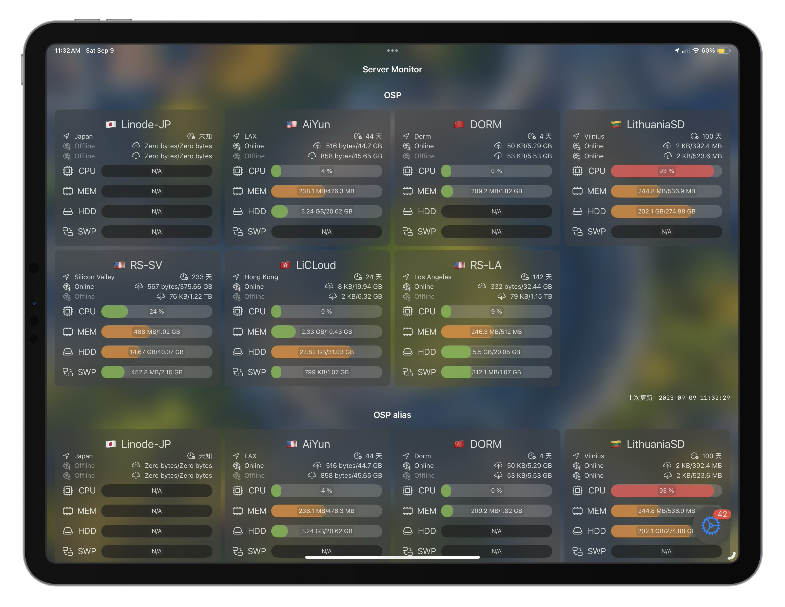
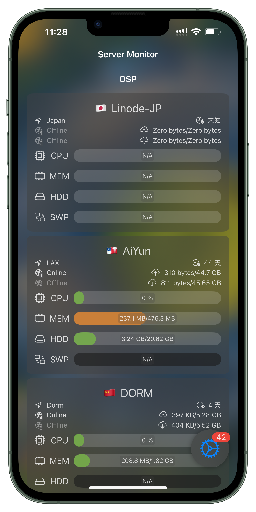

# Server-Status-Mobile

Server Status Mobile is a light-weight application providing you with real-time infomation of servers based on APIs of several open source projects.

> 本项目是[Server-Status-Mobile](https://github.com/weirui-kong/Server-Status-Mobile/)重写版本，占用更低、更加符合设计规范。目前已经完成了基本的搭建。下一步是添加Core Data的支持，使得数据能够持久化；完善图床的配置等。

# Mockup

## iPad Pro 12.9"

## iPhone 13 Pro Max
